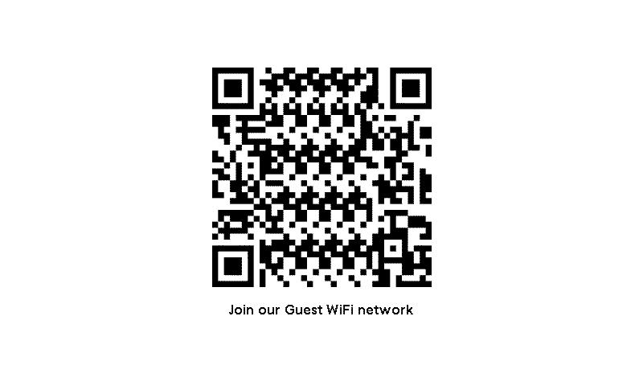

# The Join WiFi Panel

The `join-wifi` panel displays a QR code that can be scanned by a mobile device to join a WiFi network. An optional message can be displayed underneath the QR code for additional context.

<div align="center">
  
</div>

## Configuration

``` yaml
- name: join-wifi
  settings:
    ssid: ssid
    password: password
    encryption: WPA
    message: Join our Guest WiFi network
```

### Settings

| Setting      | Type    | Required | Default | Description                                                          |
| ------------ | ------- | :------: | :-----: | -------------------------------------------------------------------- |
| `ssid`       | String  | Yes      | -       | The SSID of the WiFi network.                                        |
| `password`   | String  | Yes      | -       | The password for the WiFi network.                                   |
| `encryption` | String  | Yes      | -       | The encryption type used by the WiFi network, can be `WPA` or `WEP`. |
| `hidden`     | Boolean | No       | `false` | Whether the WiFi network is a hidden network.                        |
| `message`    | String  | No       | -       | A message to display underneath the QR code.                         |
