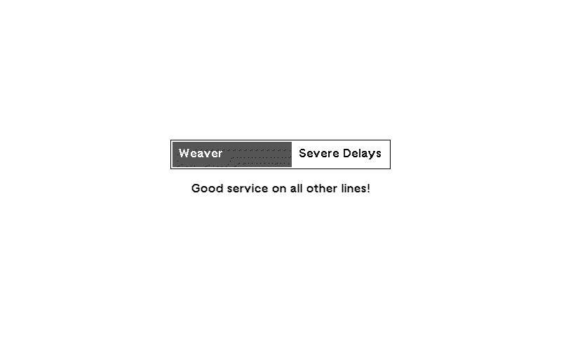

# The Tube Status Panel

The `tube-status` panel displays the status of TFL lines that are currently experiencing disruption. Only lines that are **not** in good service will be shown; when all lines are running normally the panel will simply display a "Good service on all lines!" message.

Up to 8 disrupted lines can be displayed at once. If there are more than 8 disrupted lines, the panel will indicate how many additional lines are also affected.

<div align="center">
  
</div>

## Configuration

``` yaml
- name: tube-status
  settings:
    prioritizing:
      - piccadilly
      - dlr
      - elizabeth
```

### Settings

| Setting        | Type  | Required | Default | Description                                                                                                                                                                                                                                                                                                                                                                                                                                                                                                                         |
| -------------- | ----- | :------: | :-----: | ----------------------------------------------------------------------------------------------------------------------------------------------------------------------------------------------------------------------------------------------------------------------------------------------------------------------------------------------------------------------------------------------------------------------------------------------------------------------------------------------------------------------------------- |
| `prioritizing` | Array | No       | -       | A collection of no more than 8 TFL line identifiers to prioritize. Prioritizing a line does **not** mean it will always be shown; it only ensures that the line will appear ahead of others during times when many lines are disrupted and not all can fit on screen. Accepted values: `bakerloo`, `central`, `circle`, `district`, `hammersmith-city`, `jubilee`, `metropolitan`, `northern`, `piccadilly`, `victoria`, `waterloo-city`, `liberty`, `lioness`, `mildmay`, `suffragette`, `weaver`, `windrush`, `elizabeth`, `dlr`. |
